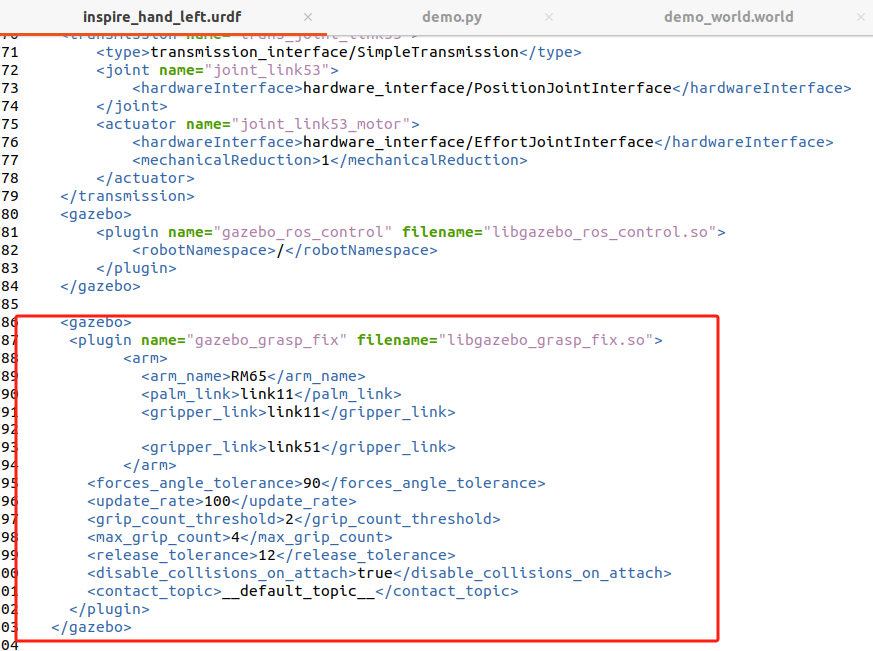

# gazebo_grasp
Based on the co-simulation of MoveIt and Gazebo, the grasping demo of the dexterous hand of the robotic arm is realized


## 使用步骤

将gazebo_grasp放入你的工作空间的src文件夹下（例如：home/rm/catkin_ws/src/gazebo_grasp），然后使用catkin build编译

```
catkin build general-message-pkgs-master
catkin build gazebo-pkgs-noetic
catkin build
source devel setup.bash
```

编译通过后，运行

```
roslaunch lora_moveit_config demo_gazebo.launch
```

会打开gazebo的仿真界面

此时在/gazebo_grasp文件夹下打开终端，运行

```
python demo.py
```

模型就会开始抓取步骤。

灵巧手抓取存在难点，如何判断物体被抓取，碰撞如何处理，当前的灵巧手控制器采用的每个手指关节的角度控制，这样的控制就存在

## Grasp_fix插件下载

这个插件来自JenniferBuehler大佬，主要解决了在Gazebo中机械夹爪在抓取物体时出现的掉落和抖动等问题，在检测到机械爪与物体发生接触或碰撞时，就会把夹爪和物体合成一个整体，这样就能够防止物体抓不起来的情况。

下载地址：https://github.com/JenniferBuehler/gazebo-pkgs/tree/master/gazebo_grasp_plugin

这个插件的官方介绍在wiki上有：https://github.com/JenniferBuehler/gazebo-pkgs/wiki/The-Gazebo-grasp-fix-plugin

插件在URDF里应该如下写法

 

<arm_name>是一个单独的名字，不能和别的任何关节同名，可以理解为你的检测器命名

<palm_link>是和手指相连的关节，这里我直接用了机械臂末端关节，也没遇到啥问题

<gripper_link>是会检测碰撞的关节，建议把实际和物体发生接触的关节写上

<forces_angle_tolerance>这个检测相互作用力，当两个力的夹角大于这个阈值时，才会被认为是相互作用力。插件的源程序中默认角度要大于90度，这里很好理解，两个力要朝相反的方向才符合相互作用力的条件。

<update_rate>是检测频率，建议稍微调高一点

<grip_count_threshold>是检测为抓取状态的接触次数阈值？就是在夹爪和物体之间会有接触，超过多少次之后会被抓起来，可能我理解的不正确，但是我觉得这个值太大了就会使物体被抓起来不是很容易

<max_grip_count>这个最好比上边的阈值大2倍，具体原因也不是很明白

<release_tolerance>这个很重要！！！不要设置太大，否则张开也不会把物体放下，会粘在夹爪上，这个就是释放时的容忍度，超过这个就会把物体放下。具体的可以在实验中慢慢试。

<disable_collisions_on_attach>在附着的状态下是否考虑碰撞，如果。

总结一下，就是<release_tolerance>很重要，会影响能不能放下物体，还有记得把物体厚度大一些，否则很难检测到物体。

 